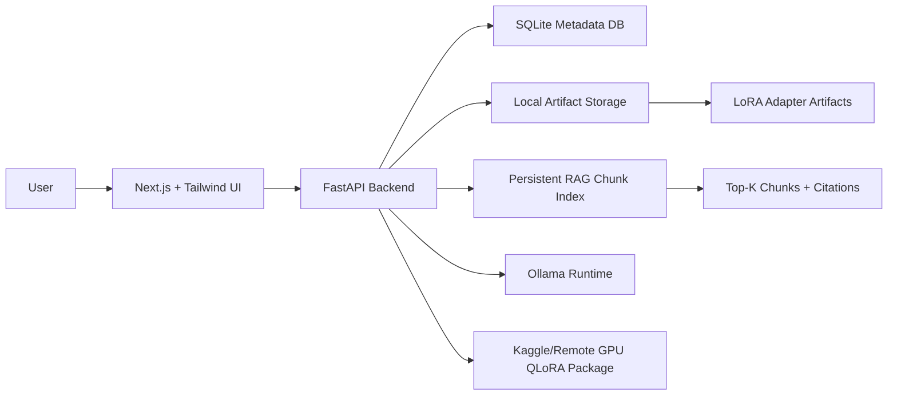

# ModelForge

No-code LLM customization and deployment platform for dataset preparation, LoRA/QLoRA fine-tuning, RAG over documents, model registry, and Ollama deployment.

## Problem

Organizations need custom LLMs trained on private data, connected to internal documents, evaluated, and deployed. Today this usually requires ML engineers to manually configure datasets, LoRA adapters, vector search, quantization, and serving tools. ModelForge provides a visual workflow for these operations.

## Current Capabilities

- Upload CSV/JSONL datasets for fine-tuning.
- Generate training datasets from PDFs.
- Start local CPU-safe LoRA smoke tests.
- Prepare Kaggle/remote GPU QLoRA packages for real Qwen adapter training.
- Import Qwen LoRA adapter ZIP files.
- Register fine-tuned adapters with metadata.
- Validate whether an adapter is deployable to Ollama.
- Deploy valid adapters to Ollama when local Ollama permissions allow it.
- Chat with base and deployed runtime models.
- Upload PDFs into RAG document management.
- Extract page text, chunk documents, persist chunks, retrieve top-k evidence, and show citations.
- Evaluate live project state through the Evaluation dashboard.

## Architecture



## Main Workflow

```text
Upload PDF / Dataset
-> Generate or upload JSONL
-> Fine-tune locally for smoke test or remotely with QLoRA
-> Import trained Qwen adapter
-> Validate adapter artifact
-> Deploy adapter to Ollama
-> Chat with deployed model
-> Ask document questions through RAG with citations
```

## Model Selection

Primary open-source runtime:

- `qwen2.5:1.5b` via Ollama for local inference.
- `unsloth/Qwen2.5-1.5B-Instruct-bnb-4bit` for remote QLoRA training.
- `sshleifer/tiny-gpt2` only for CPU-safe local smoke tests.

Reasoning:

- Qwen 1.5B is small enough for local demos and realistic enough for instruction tuning.
- Unsloth QLoRA supports GPU-efficient adapter training.
- Ollama provides local serving without external API keys.

## RAG Design

- PDF extraction: `pypdf`
- Chunking: around 1100 characters with around 180 character overlap
- Metadata: document id, document name, page number, chunk id, owner
- Persistent storage: `backend/vector_store/chunks.jsonl`
- Retrieval: top-k local keyword relevance scoring
- Output: answer, sources, citations, retrieval metrics

For demo stability, ModelForge uses a persistent local chunk index by default. This avoids slow embedding rebuilds during upload. Vector embeddings/FAISS remain a future advanced retrieval mode.

## Setup

Backend:

```powershell
cd backend
venv\Scripts\activate
pip install -r requirements.txt
python -m uvicorn main:app --reload --port 8000
```

Frontend:

```powershell
cd frontend
npm install
npm run dev
```

Open:

```text
http://localhost:3000
```

## Environment

Copy `.env.example` to `.env` and adjust values if needed. Do not commit real API keys.

## Demo Scenarios

1. Upload a PDF in RAG, ask a question, show retrieved top-k chunks and citations.
2. Open My Models, show deploy-ready imported Qwen adapter and blocked smoke-test adapters.
3. Open Pipeline/Evaluation dashboards, show dataset count, training jobs, adapters, RAG status, and loss/evidence metrics.

## Known Limitations

- Local CPU fine-tuning is only a smoke test, not production Qwen training.
- Real Qwen training is handled through remote GPU package workflow.
- Ollama adapter deployment may fail on Windows if Ollama cannot access generated adapter files.
- RAG uses local keyword retrieval by default for demo stability; embedding/vector retrieval is future scope.
- SQLite/local filesystem are used for FYP/demo scope; production should use PostgreSQL and object storage.
